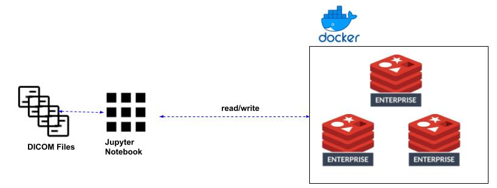
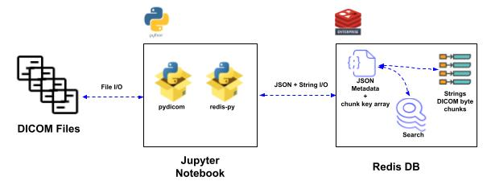
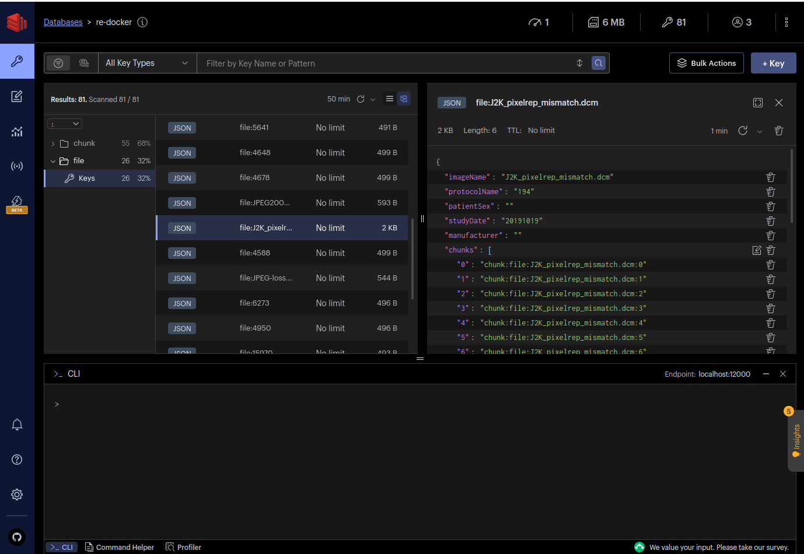
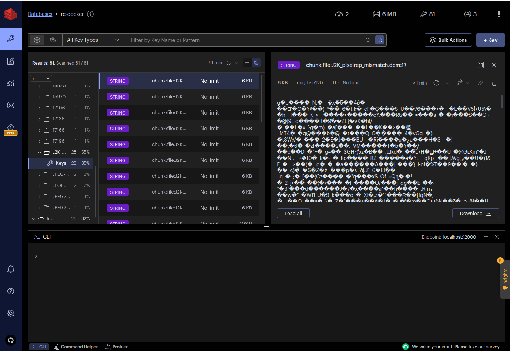

# Redis + DICOM Demo  

## Contents
1.  [Summary](#summary)
2.  [Architecture-High](#arch-high)
3.  [Architecture-Low](#arch-low)
4.  [Features](#features)
5.  [Prerequisites](#prerequisites)
6.  [Installation](#installation)
7.  [Scenario 1](#scenario1)
8.  [Scenario 2](#scenario2)
9.  [Scenario 3](#scenario3)
10. [Speed Test](#speedtest)

## Summary <a name="summary"></a>
This is a Jupyter notebook that loads a DICOM data set into Redis.  A JSON object is used to hold DICOM meta data and array of keys for strings holding byte chunks of the DICOM file.  Those JSON objects can subsequently be indexed and searched against the DICOM meta data. The DICOM byte chunks are stored as Redis strings. 

## Architecture - High <a name="arch-high"></a>
  

## Architecture - Low <a name="arch-low"></a>
  

## Features <a name="features"></a>
- Loads DICOM data from files to Redis JSON + strings
- Demonstrates fidelity of the Redis by restoring the files from the Redis string binaries.
- Demonstrates Search and Aggregation against the DICOM meta data 

## Prerequisites <a name="prerequisites"></a>
- Docker
- Python
- Jupyter

## Installation <a name="installation"></a>
1. Clone this repo.
2. Follow notebook steps

## Redis Insight Screenshots <a name="insight"></a>
Screenshot of an example JSON object containing DICOM meta-data + byte chunk keys
  

Screenshot of an example String containing a DICOM byte chunk
 

## Scenario 1 <a name="scenario1"></a>
Hypothetical Business Problem: Retrieve all the bytes of an image given a known file name
```bash
Exec time: 1.36 ms
Bytes Retrieved: 9844
```

## Scenario 2 <a name="scenario2"></a>
Hypothetical Business Problem: Find a DICOM image with the 'protocolName' of '194' and 'studyDate' in 2019.  Retrieve all file bytes.
```bash
Exec time: 7.64 ms
Image name: J2K_pixelrep_mismatch.dcm
Bytes Retrieved: 138518
```

## Scenario 3 <a name="scenario3"></a>
Hypothetical Business Problem: Find the count of DICOM images by protocol
```bash
Exec time: 1.77 ms
ANGIO Projected from C: 7
T/S/C RF FAST PILOT: 6
1.1 Routine Brain: 4
FAST LOCALIZER: 4
Whole Body Bone: 4
194: 1
```

## Speed Test <a name="speedtest"></a>
There is a Python asyncio app included for allowing scaled file retrievals.  The application allows for configuration of chunk sizes and number of Redis client connections.
### Sample Results
I ran this app in a VM on Google Cloud in the same region as a Redis Cloud Flexible cluster.  Below are some results.  I set up VPC peering between the app VM and the Redis instance.  Network latency was ~.3ms.

#### Sample Command and Results
```bash
python3 svs_speed_test.py --url=redis://default:<pwd>@<redis-uri> --chunk_size=64 --connections=1
```

```text
*** File Retrieval Test - 64 KB Chunks, 1 Client Connections ***
test.svs Size: 1579.72 MB
Files loaded: 1

Key: file:test.svs
Exec time: 16794.48 ms
Bytes Retrieved: 1656460030
File integrity check:  Pass
```

```text
*** File Retrieval Test - 64 KB Chunks, 5 Client Connections ***
test.svs Size: 1579.72 MB
Files loaded: 1

Key: file:test.svs
Exec time: 6996.46 ms
Bytes Retrieved: 1656460030
File integrity check:  Pass
```

```text
*** File Retrieval Test - 64 KB Chunks, 10 Client Connections ***
test.svs Size: 1579.72 MB
Files loaded: 1

Key: file:test.svs
Exec time: 5411.64 ms
Bytes Retrieved: 1656460030
File integrity check:  Pass
```
```text
*** File Retrieval Test - 64 KB Chunks, 20 Client Connections ***
test.svs Size: 1579.72 MB
Files loaded: 1

Key: file:test.svs
Exec time: 4655.77 ms
Bytes Retrieved: 1656460030
File integrity check:  Pass
```

```text
*** File Retrieval Test - 64 KB Chunks, 50 Client Connections ***
test.svs Size: 1579.72 MB
Files loaded: 1

Key: file:test.svs
Exec time: 4091.87 ms
Bytes Retrieved: 1656460030
File integrity check:  Pass
```

```text
*** File Retrieval Test - 128 KB Chunks, 50 Client Connections ***
test.svs Size: 1579.72 MB
Files loaded: 1

Key: file:test.svs
Exec time: 3738.14 ms
Bytes Retrieved: 1656460030
File integrity check:  Pass
```

```text
*** File Retrieval Test - 256 KB Chunks, 50 Client Connections ***
test.svs Size: 1579.72 MB
Files loaded: 1

Key: file:test.svs
Exec time: 3703.09 ms
Bytes Retrieved: 1656460030
File integrity check:  Pass
```

```text
*** File Retrieval Test - 512 KB Chunks, 50 Client Connections ***
test.svs Size: 1579.72 MB
Files loaded: 1

Key: file:test.svs
Exec time: 3566.06 ms
Bytes Retrieved: 1656460030
File integrity check:  Pass
```
